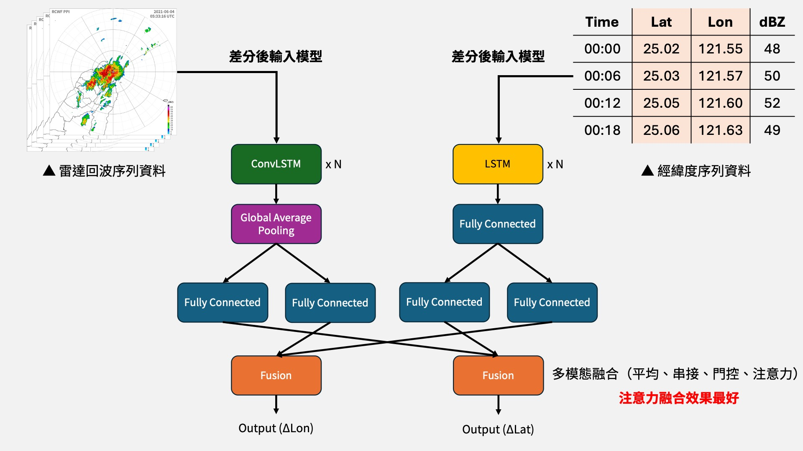
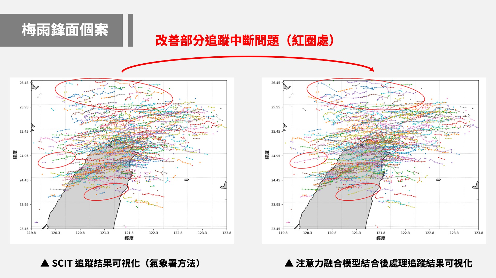

# Multimodal Fusion & Deep Learning for Convective Cell Forecasting and Tracking

> **結合多模態融合策略與深度學習於對流胞預測與追蹤之應用**<br>
> **Application of Multimodal Fusion Strategies and Deep Learning in Convective Cell Forecasting and Tracking**
>
> 國立中興大學 資訊管理學系 碩士論文
>
> 研究生：賴昱丞 ｜ 指導教授：林冠成
>
> [論文全文（臺灣博碩士論文知識加值系統）](https://hdl.handle.net/11296/q9n3de)

## Abstract

Accurate prediction and continuous tracking of convective cells are critical for weather forecasting and disaster prevention. This study proposes a deep learning framework integrating **LSTM** and **ConvLSTM** with multimodal fusion strategies to predict latitude/longitude displacements of SCIT-identified convective cells, combined with a post-processing tracking mechanism to enhance trajectory integrity.

Through systematic experiments comparing model architectures, feature representations, data partitioning strategies, and fusion methods, results demonstrate that **differenced features** and **month-based data splitting** improve prediction stability, while **attention-based fusion** achieves the best overall performance — reducing average geographic error to **2.43 km**.

## Research Highlights

- LSTM 相較傳統 FFNN 模型，平均地理誤差降低約 **22%**（17.68 km &rarr; 13.72 km）
- 差分特徵處理使誤差大幅下降超過 **79%**（13.72 km &rarr; 2.83 km）
- 月份切割策略較時序切割進一步降低誤差約 **21%**
- 注意力融合機制在快速變異天氣型態下表現最佳
- 結合「先預測後追蹤」機制有效修正 SCIT 路徑碎裂問題

## Tech Stack

| Category | Details |
|---|---|
| Language | Python 3.10 |
| Deep Learning Framework | TensorFlow 2.10 (Keras) |
| Models | LSTM, ConvLSTM, FFNN |
| Learning Paradigm | Multi-task Learning, Multimodal Fusion |
| Fusion Strategies | Concat / Average / Gate / Attention |
| Data Source | SCIT Numerical Data, Radar Echo (dBZ) |
| Visualization | Matplotlib, Plotly |
| Environment | Jupyter Notebook |

## Project Structure

Each directory corresponds to a specific experiment in the thesis (Chapter 4):

```
.
├── 1.ffnn_vs_time_series_model/   # Exp 4.2 — FFNN vs. LSTM/ConvLSTM
├── 2.origin_vs_difference/        # Exp 4.3 — Original vs. Differenced Features
├── 3.month_vs_sequence_split/     # Exp 4.4 — Month-based vs. Sequential Split
├── 4.fusion/                      # Exp 4.5 — Multimodal Fusion Strategies
├── 5.tracking/                    # Exp 4.6 — Convective Cell Tracking Application
└── 6.multi-step/                  # Exp 4.7 — Multi-step Prediction Stability
```

### 1. FFNN vs. Time Series Model（序列模型對 FFNN 預測侷限之補強）

對應論文 **4.2 節**。比較靜態前饋神經網路（FFNN）與時間序列模型（LSTM）在對流胞路徑預測上的差異。LSTM 透過學習時間序列中的累積位移趨勢，有效捕捉對流胞非線性移動行為，在所有天氣型態個案中均優於 FFNN。

- `ffnn/` — 基於 Borghi et al. (2024) 的 FFNN 基準模型
- `time_series_model/` — LSTM 與 ConvLSTM 時間序列模型

### 2. Original vs. Difference（差分處理對預測能力的提升）

對應論文 **4.3 節**。探討將原始經緯度座標轉換為位移差分量是否能提升模型預測能力。差分處理有效平滑化輸入數據、消除地理尺度差異與座標偏移影響，平均地理誤差距離從 13.72 km 大幅降至 2.83 km。

- `origin/` — 使用原始經緯度作為模型輸入
- `difference/` — 使用經緯度差分值作為模型輸入

### 3. Month vs. Sequence Split（資料切割策略比較）

對應論文 **4.4 節**。比較按月份切割與按時序切割兩種資料劃分策略對預測成效的影響。月份切割可維持較佳的季節性均衡，降低模型受長期趨勢偏移的影響，各項誤差指標改善幅度達 20% 以上。

### 4. Fusion（多模態融合策略評估）

對應論文 **4.5 節**。設計並比較四種多模態融合策略（LSTM + ConvLSTM）：

| Fusion Strategy | Description |
|---|---|
| **Concat Fusion** | 直接串接兩模態特徵 |
| **Average Fusion** | 對兩模態特徵取平均 |
| **Gate Fusion** | 透過門控機制自適應加權融合 |
| **Attention Fusion** | 透過注意力機制動態調整模態權重 |

注意力融合在整體表現上最為優異，尤其在午後對流與颱風外圍環流等快速變異型態下具備最佳誤差控制能力。

### 5. Tracking（對流胞追蹤應用驗證）

對應論文 **4.6 節**。將最佳預測模型（注意力融合）應用於實際對流胞追蹤任務，結合「先預測後追蹤」（Predict-then-Track）機制，有效修正 SCIT 系統產生的路徑碎裂與紊亂問題。包含三個天氣個案的追蹤結果：

- `梅雨鋒面個案_2021-05-30/` — Mei-Yu Front Case
- `烟花颱風個案_2021-07-22/` — Typhoon In-Fa Case
- `午後對流個案_2022-08-25/` — Afternoon Convection Case

### 6. Multi-step（多步預測穩定性測試）

對應論文 **4.7 節**。測試不同輸入序列長度（2~5 步輸入 / 2 步預測）下模型的延展穩定性。結果顯示隨輸入序列增加，預測誤差呈穩定下降趨勢，以 4 步輸入時達到最佳表現（平均誤差 2.43 km）。涵蓋 LSTM、ConvLSTM 及注意力融合模型的完整對比實驗。

## Case Studies

本研究以三種代表性天氣型態進行模型驗證：

| Case | Date | Weather Type | Description |
|---|---|---|---|
| Mei-Yu Front | 2021-05-30 | 梅雨鋒面 | Large-scale frontal convection with organized movement |
| Typhoon In-Fa | 2021-07-22 | 颱風外圍環流 | Typhoon-induced outer circulation convection |
| Afternoon Convection | 2022-08-25 | 午後對流 | Terrain-triggered short-lived convection |

## Model Architecture



### Tracking Result — Mei-Yu Front Case



## Key References

- Borghi, P. H., et al. (2024). *Forecasting Convective Storms Trajectory and Intensity by Neural Networks.* — FFNN baseline
- Shi, X., et al. (2015). *Convolutional LSTM Network: A Machine Learning Approach for Precipitation Nowcasting.* — ConvLSTM architecture
- Johnson, J. T., et al. (1998). *The Storm Cell Identification and Tracking Algorithm: An Enhanced WSR-88D Algorithm.* — SCIT system

## License

This project is part of a master's thesis at National Chung Hsing University. For academic use only.
